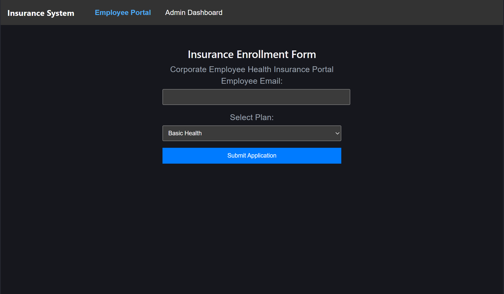
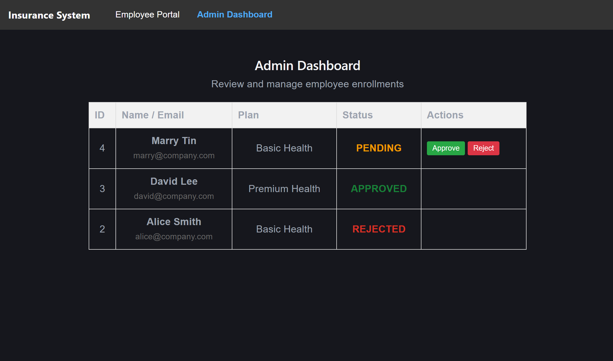
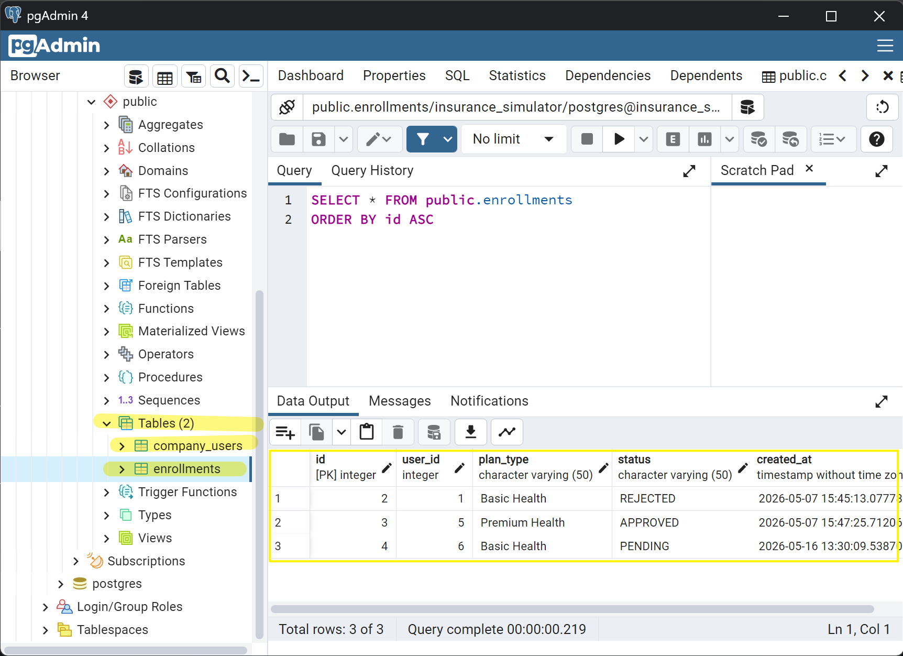
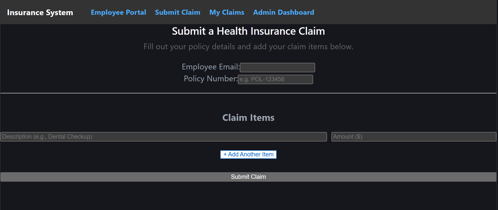
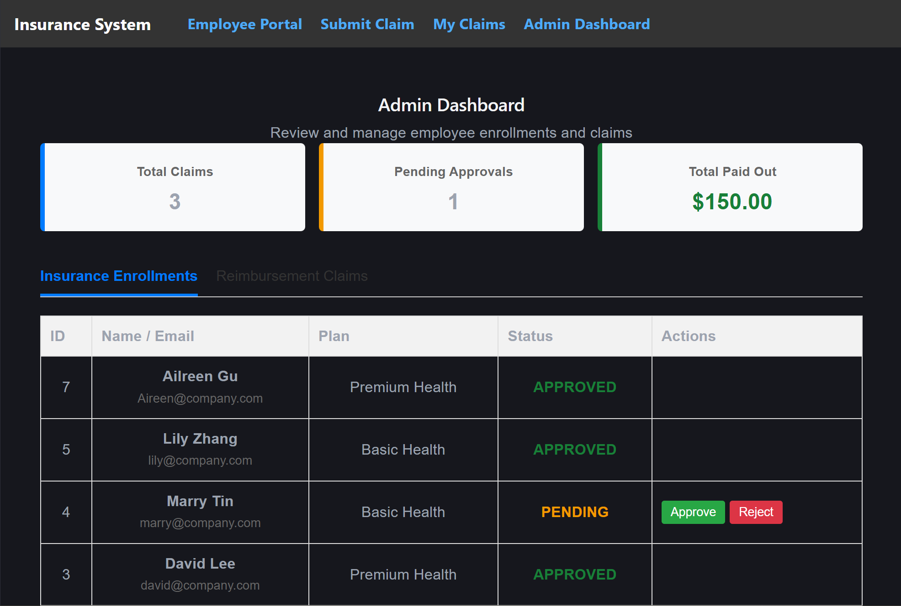

# Corporate Health Insurance Enrollment Simulator

A full-stack web application simulating a real-world corporate health insurance enrollment workflow. This project demonstrates core full-stack development skills including RESTful API design, database state management, and business rules validation.

## 📸 Visual Overview

### 1. Employee Portal (User Interface)
*A simple, user-friendly interface for employees to select their health plans and submit applications safely.*


### 2. HR Admin Dashboard (Management Interface)
*A dedicated dashboard where HR administrators can easily view all applications and instantly `Approve` or `Reject` them with one click.*


### 3. Database State (Backend Data)
*The system safely and accurately records all transitions and states (PENDING, APPROVED, REJECTED) in a robust PostgreSQL database.*


## � Features

- **Employee Portal**: Employees can seamlessly submit their health insurance enrollment applications.
- **Business Rules Engine (Backend)**: 
  - **Identity Verification**: Validates employee existence against a mock HR company whitelist.
  - **Age Restriction**: Enforces eligibility (must be 18 or older to enroll).
  - **Anti-Duplication**: Prevents duplicate enrollment submissions.
- **Admin Dashboard**: HR/Admins can view all pending applications and instantly `Approve` or `Reject` them via state transitions.
- **Full-Stack Integration**: Reliable communication between the React frontend and PostgreSQL database.

## 🚀 Advanced Module: Claims Processing System

Built on top of the MVP, this update introduces a robust **Reimbursement Claims System**, focusing on enterprise-level data integrity and complex business logic:
- **Database Transactions (ACID)**: Ensures atomic saves for multi-table records (Claims, Items, and History) with rollback support to prevent orphan data.
- **State Machine Workflow**: Automated tracking of claim statuses (PENDING -> APPROVED/REJECTED) with full audit history.
- **Advanced Business Rules**: Strict validations for active policies and historical consumption against annual limits ($1000 Basic / $3000 Premium).
- **KPI Data Aggregation**: Utilizes advanced PostgreSQL functions (`GROUP BY`, `SUM()`, `json_agg`) to drive a real-time analytics dashboard.

*Claims Management Dashboard:*



## 🛠️ Tech Stack

- **Frontend**: React (Vite)
- **Backend**: Node.js, Express.js
- **Database**: PostgreSQL (with `pg` driver)

## 🧠 What I Learned (Architecture Refactoring)

I successfully transitioned this project from a basic MVP into a scalable, enterprise-grade application by applying core software engineering principles:
- **Frontend Modularization**: Extracted React components, pages, and centralized API services to achieve clean UI rendering and easy maintenance.
- **Seamless Routing**: Integrated `react-router-dom` to replace state-based views with a true single-page application (SPA) experience.
- **Backend MVC Pattern**: Decoupled the Node.js backend into Routes, Controllers, and Services, strictly separating business logic from HTTP requests.
- **Centralized Error Handling**: Built global Express middleware to catch and format API errors consistently, eliminating repetitive code and ensuring a predictable user experience.

## 📦 Getting Started

### Prerequisites
- Node.js (v18+ recommended)
- PostgreSQL installed and running locally

### 1. Database Setup
1. Open pgAdmin or your psql terminal.
2. Create a new database named `insurance_simulator`:
   ```sql
   CREATE DATABASE insurance_simulator;
   ```
3. Navigate to the `backend` folder and run the initialization script to create tables and insert mock data:
   ```bash
   cd backend
   node init_db.js
   ```

### 2. Environment Variables
In the `backend` directory, create a `.env` file with your PostgreSQL credentials:
```env
DB_USER=postgres
DB_PASSWORD=your_password
DB_HOST=localhost
DB_PORT=5432
DB_NAME=insurance_simulator
PORT=3000
```

### 3. Start the Backend Server
```bash
cd backend
npm install
npm run dev
```
The API will run on `http://localhost:3000`.

### 4. Start the Frontend Client
Open a new terminal window:
```bash
cd frontend
npm install
npm run dev
```
The web application will open at `http://localhost:5173`.

## 💡 Usage Example

1. **Test Success**: Go to the **Employee Portal** and enroll with `alice@company.com` (if not already enrolled).
2. **Test Age Validation**: Try enrolling with `bob@company.com` (Minor, throws a 403 error).
3. **Test Unknown User**: Try enrolling with a random email (throws a 404 error).
4. **Admin Approval**: Switch to the **Admin Dashboard** via the top navigation bar to approve or reject pending requests.
