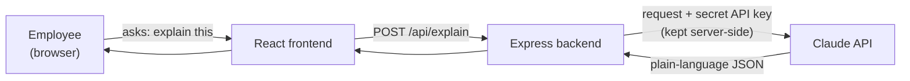

# Claude AI Integration — Overview

This folder documents how we added an **AI plain-language explainer** to the
Insurance Enrollment Simulator, one step at a time. Each step has its own spec
file with what changed, why, how it works, and the test result.

## What we are building

The system makes decisions in technical language — status codes like `403`,
states like `REJECTED`, and rules like annual claim limits. Employees do not
speak that language. The explainer uses Claude (an AI model) to turn any
decision into a clear, kind explanation plus concrete next steps.

**Example.** A 15-year-old is blocked from enrolling. Instead of
`403 Eligibility failed`, the employee sees:

> "Right now, this plan is only open to people who are 18 or older. Since you
> are 15, you are not able to join this one yet. This is just a rule for this
> plan, and it is nothing you did wrong."

## How it fits together

The secret API key lives only on the backend (`backend/.env`). The browser never
sees it.

## Steps

| Step | Spec | What it adds | Status |
|------|------|--------------|--------|
| 1 | [01-setup-and-sdk.md](01-setup-and-sdk.md) | Install the Claude SDK + add the API key | ✅ Done |
| 2 | [02-explainer-service.md](02-explainer-service.md) | The core service that calls Claude | ✅ Done |
| 3 | [03-http-endpoint.md](03-http-endpoint.md) | HTTP endpoint (`POST /api/explain`) | ✅ Done |
| 4 | [04-eval-harness.md](04-eval-harness.md) | Evaluation harness (quality checks) | ✅ Done |
| 5 | [05-frontend-ui.md](05-frontend-ui.md) | Frontend button to show explanations | ✅ Done |

## Tech used

- **Model:** Claude Opus 4.8 (`claude-opus-4-8`)
- **Library:** `@anthropic-ai/sdk` (official Anthropic SDK for Node.js)
- **Backend:** Node.js + Express (existing)
- **Frontend:** React + Vite (existing)
