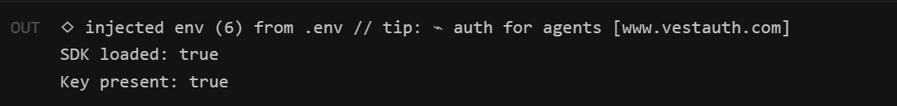

# Step 1 — Setup & SDK

## What changed

We added the tools needed to talk to Claude:

1. Installed the official Claude library (`@anthropic-ai/sdk`) in the backend.
2. Added a secret API key to `backend/.env`.

## Why

- The **library** is the official, supported way to call Claude from Node.js.
- The **API key** is like a password for the AI service. It must stay on the
  server, never in the browser, or anyone could see it and run up our bill.

## Files touched

| File | Change | New or existing |
|------|--------|-----------------|
| `backend/package.json` | Added `@anthropic-ai/sdk` dependency | Existing |
| `backend/.env` | Added `ANTHROPIC_API_KEY` | Existing |

`.env` is already excluded from Git (via `.gitignore`), so the key is never
committed to the code history.

## Test

Run from the `backend` folder:

```bash
node -e "require('dotenv').config(); const A=require('@anthropic-ai/sdk'); console.log('SDK loaded:', typeof A==='function'); console.log('Key present:', !!process.env.ANTHROPIC_API_KEY && process.env.ANTHROPIC_API_KEY!=='your-anthropic-api-key-here')"
```

**Expected result:**

```
SDK loaded: true
Key present: true
```

**Terminal check:**



## Result

✅ Passed — both values returned `true`.

One real-world snag surfaced here: the first live call failed with *"credit
balance is too low."* The key was valid; the account simply had no funds. After
adding a small amount of credit, calls worked. (Good reminder that an AI feature
has a per-call cost.)

