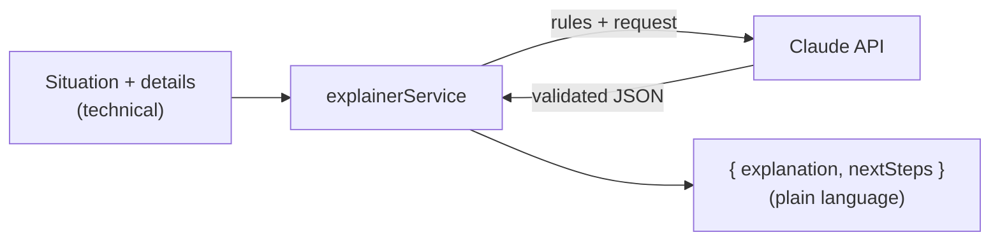
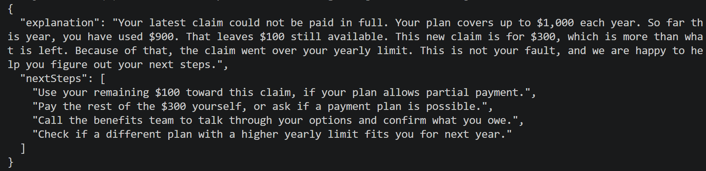

# Step 2 — The Explainer Service

## What changed

We created the "brain" of the feature:
`backend/services/explainerService.js`. It takes a system situation and returns
a plain-language explanation plus next steps.

This sits in the same layer as the existing `enrollmentService.js` and
`claimService.js`, keeping the project's clean structure (Routes → Controllers →
Services).

## How it works



Three design choices make it reliable:

| Choice | What it means | Why it matters |
|--------|---------------|----------------|
| **Fixed output shape** | Claude must return exactly `{ explanation, nextSteps }` | Predictable for the frontend; easy to test |
| **Strict rules in the prompt** | No jargon; never invent numbers, dates, or rules | Keeps answers safe and honest in a health context |
| **Typed error handling** | Bad key, rate limit, billing, and network errors each map to a clear message | Easy to diagnose; users see clean text, developers see the real cause in logs |

The output shape:

| Field | Type | Meaning |
|-------|------|---------|
| `explanation` | text | A short, kind, jargon-free explanation |
| `nextSteps` | list of text | Concrete actions the person can take |

## Files touched

| File | Change | New or existing |
|------|--------|-----------------|
| `backend/services/explainerService.js` | Created the service | New |

## Test

A direct one-off call to the service (no web server needed), using a real case
— a claim that goes over the plan's yearly limit:

```bash
node -e "require('dotenv').config(); const s=require('./services/explainerService'); s.explain({situation:'Claim rejected: limit exceeded for your plan.', details:'Plan: Basic Health, annual limit \$1000. Already used \$900. This claim is \$300.'}).then(r=>console.log(JSON.stringify(r,null,2)))"
```

**Expected result:** a JSON object with `explanation` and `nextSteps`, in plain
language, using only the numbers we supplied.

## Result

✅ Passed. Actual output:

```json
{
  "explanation": "Your plan covers up to $1,000 in costs each year. You have already used $900 of that. This new claim is $300, which would bring you over the yearly limit. Because of that, the plan could not cover this claim. This is not your fault, and there are still ways to get help.",
  "nextSteps": [
    "Check your remaining amount: you have about $100 left for the year.",
    "Ask if the part under your limit ($100) can be paid, leaving you to cover the rest.",
    "Call the benefits team to talk about payment options for the leftover cost.",
    "Look into other plans or extra coverage when the next sign-up time comes."
  ]
}
```

Quality checks against our goals:

| Goal | Result |
|------|--------|
| No technical jargon | ✅ No status codes or system terms |
| Grounded — no invented numbers | ✅ Used only $1,000 / $900 / $300, and correctly derived $100 left |
| Warm and non-judgmental | ✅ "This is not your fault" |
| Actionable next steps | ✅ Four concrete options |

A small bug was found and fixed here too: a billing error (HTTP 400) was first
mislabeled as a network error ("could not be reached"). We added a dedicated
branch so billing/config problems report accurately.

**Terminal output:**


