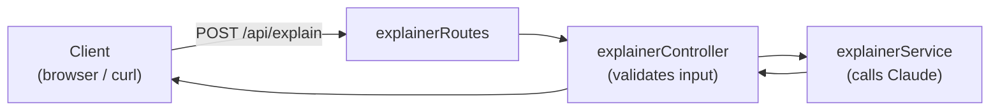
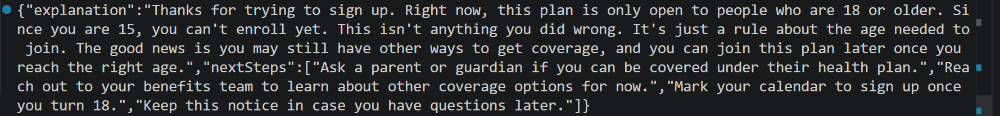

# Step 3 — HTTP Endpoint

## What changed

We exposed the explainer service as a real web endpoint: `POST /api/explain`.
Now the frontend (or any client) can ask for an explanation over HTTP.

We followed the project's existing 3-layer pattern, so the new code mirrors the
enrollment and claims features exactly:



## Why

- A service alone can't be reached from outside. The **route** gives it a URL,
  the **controller** handles the HTTP request and checks the input.
- Validating input here (e.g. `situation` is required) blocks bad requests
  *before* they reach Claude — which avoids a wasted, paid API call.

## Files touched

| File | Change | New or existing |
|------|--------|-----------------|
| `backend/controllers/explainerController.js` | Reads body, validates, calls service | New |
| `backend/routes/explainerRoutes.js` | Maps `POST /explain` to the controller | New |
| `backend/server.js` | Mounted the new route under `/api` (2 lines) | Existing |

## API reference

**`POST /api/explain`**

Request body:

| Field | Required | Description |
|-------|----------|-------------|
| `situation` | Yes | What happened, in system terms (e.g. a rejection message) |
| `details` | No | Extra context (plan type, amounts, age, etc.) |

Response `200`:

| Field | Type | Description |
|-------|------|-------------|
| `explanation` | text | Plain-language explanation |
| `nextSteps` | list of text | Concrete actions to take |

Errors: `400` if `situation` is missing; `429` / `502` / `503` if the AI
service is busy, unreachable, or unavailable.

## Test

**Happy path** (run in a terminal while the backend is running):

```bash
curl -s -X POST http://localhost:3000/api/explain \
  -H "Content-Type: application/json" \
  -d '{"situation":"Enrollment rejected: User must be 18 or older to enroll.","details":"The employee is 15 years old."}'
```

**Expected:** a `200` JSON object with `explanation` and `nextSteps`.

**Validation** (missing `situation`):

```bash
curl -s -X POST http://localhost:3000/api/explain \
  -H "Content-Type: application/json" \
  -d '{"details":"no situation here"}'
```

**Expected:** `HTTP 400` with `{"error":"situation is required"}`.

## Result

✅ Both passed.

- Happy path returned a clear, jargon-free explanation plus next steps.
- The validation case returned `HTTP 400 {"error":"situation is required"}` —
  rejected before any AI call was made.

**Terminal output:**


