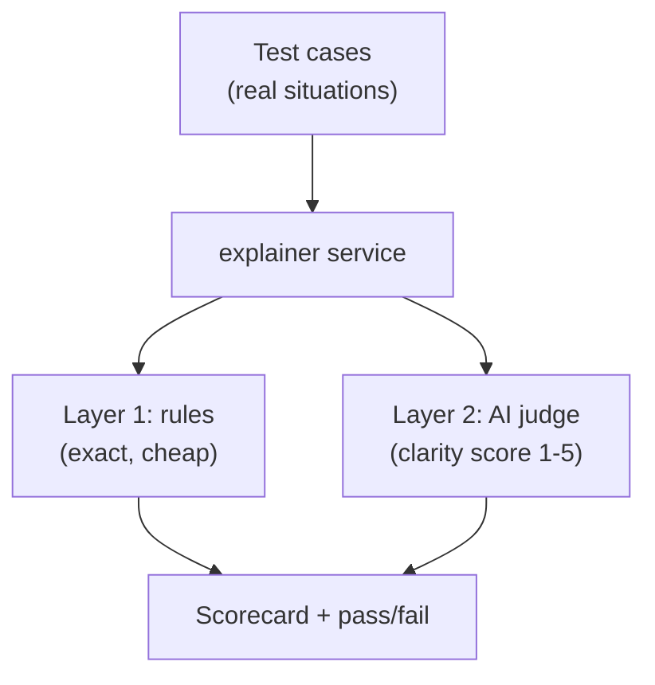
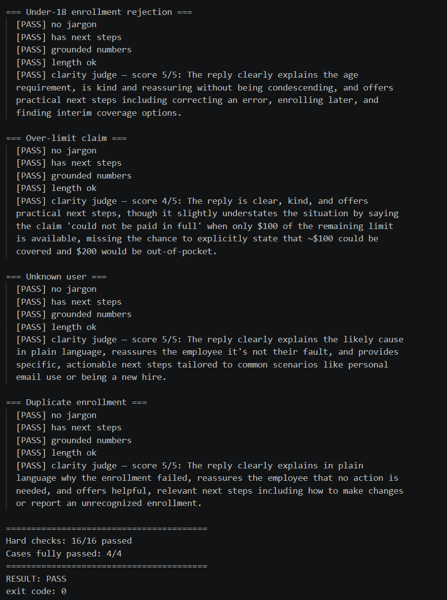

# Step 4 — Evaluation Harness

## What changed

We added an automated quality check for the AI: `backend/evals/explainer.eval.js`.
It runs the explainer against a set of realistic cases and reports whether each
response meets our standards.

## Why

An AI's answer is not guaranteed to be correct. Before trusting it in front of
employees, we should **measure** its quality, not assume it. This harness lets us
catch problems (jargon slipping in, an invented number, an unhelpful reply)
automatically, and re-check instantly whenever we change the prompt or model.

## How it works — two layers of checks



**Layer 1 — deterministic rules** (the hard gate; must all pass):

| Rule | Checks | Why it matters |
|------|--------|----------------|
| No jargon | No status codes, raw states (`PENDING`/`APPROVED`/`REJECTED`), or words like "eligibility" | Keeps it readable for non-experts |
| Has next steps | At least one next step is returned | The person must know what to do |
| Grounded numbers | Every dollar amount in the reply also appears in the input | Prevents invented figures — the most dangerous error in insurance |
| Length ok | Explanation ≤ 120 words | Long answers don't get read |

**Layer 2 — LLM-as-judge** (a signal, not the final word): a second Claude call
scores each reply 1–5 on clarity, kindness, and helpfulness, and must score ≥ 4.

> **Honest caveat (documented in the code):** the judge is itself an AI and can be
> wrong, so it is treated as a signal. The deterministic rules are the hard gate.

If any case fails, the script exits with a non-zero code — so it can later be
wired into CI as a quality gate.

## Files touched

| File | Change | New or existing |
|------|--------|-----------------|
| `backend/evals/explainer.eval.js` | The evaluation harness | New |

## Test

Run from the `backend` folder:

```bash
node evals/explainer.eval.js
```

**Expected:** every case passes all four rules, the judge scores ≥ 4, and the
script prints `RESULT: PASS`.

## Result

✅ Passed — `16/16` hard checks, `4/4` cases, judge scores 5 / 4 / 5 / 5.

```
=== Under-18 enrollment rejection ===
  [PASS] no jargon
  [PASS] has next steps
  [PASS] grounded numbers
  [PASS] length ok
  [PASS] clarity judge — score 5/5

=== Over-limit claim ===
  [PASS] no jargon
  [PASS] has next steps
  [PASS] grounded numbers
  [PASS] length ok
  [PASS] clarity judge — score 4/5

=== Unknown user ===
  [PASS] no jargon  [PASS] has next steps  [PASS] grounded numbers  [PASS] length ok
  [PASS] clarity judge — score 5/5

=== Duplicate enrollment ===
  [PASS] no jargon  [PASS] has next steps  [PASS] grounded numbers  [PASS] length ok
  [PASS] clarity judge — score 5/5

========================================
Hard checks: 16/16 passed
Cases fully passed: 4/4
========================================
RESULT: PASS
```

Notably, the judge did **not** rubber-stamp everything: it gave the over-limit
case 4/5, noting the reply could have stated more explicitly that ~$100 was
coverable and $200 would be out-of-pocket. The eval surfaces real nuance, not
just a pass/fail stamp.

**Scorecard:**


