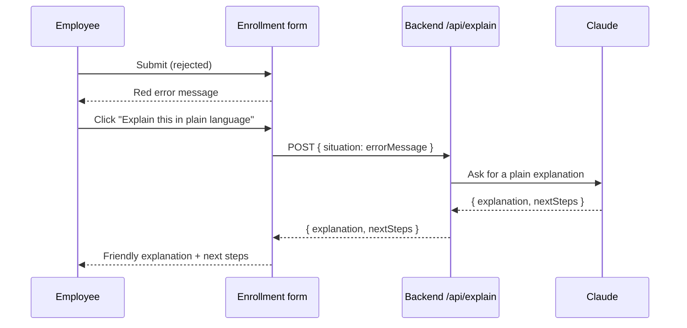
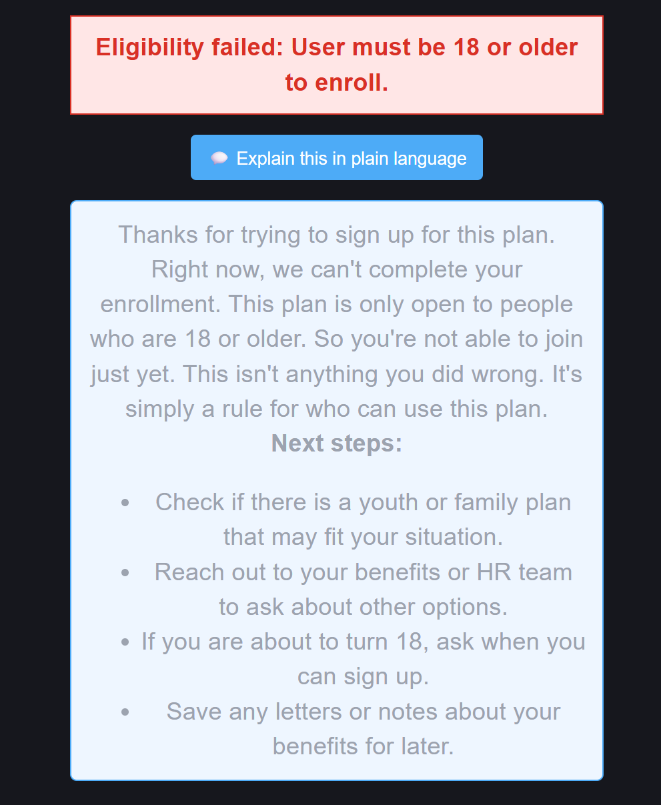

# Step 5 — Frontend UI

## What changed

We connected the explainer to the screen the employee actually uses. On the
enrollment form, when a submission is rejected, an **"Explain this in plain
language"** button appears. Clicking it shows a clear explanation and next steps.

This is the end-to-end payoff: a confused employee goes from a blunt rejection to
understanding *why* and *what to do next* — in one click.

## Why

The whole point of the feature is to help non-technical people. A backend
service no one can see does not do that. This step puts it in front of the user
at the exact moment they are confused.

## How it works

The button only appears when there is an error, so the AI (and its cost) is used
only when it actually helps.

## Files touched

| File | Change | New or existing |
|------|--------|-----------------|
| `frontend/src/services/api.js` | Added `explainSituation()` to call `/api/explain` | Existing |
| `frontend/src/pages/EnrollmentForm.jsx` | Added the button, loading state, and the explanation display | Existing |

## Test

1. Open the app at `http://localhost:5173`.
2. Enter `bob@company.com` (an under-18 employee) and submit.
3. A red error appears: *"...User must be 18 or older to enroll."*
4. Click **"💬 Explain this in plain language."**
5. After a moment, a panel shows a plain-language explanation and a "Next steps"
   list.

**Expected:** a warm, jargon-free explanation plus concrete next steps, shown
right under the error.

## Result

✅ Passed — the explanation panel appears on screen with a clear message and next
steps, matching what the backend and eval tests produced.

**UI:**

